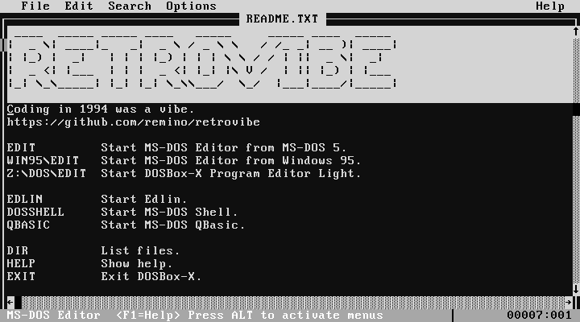

# retrovibe

Coding in 1994 was a vibe.

Rémino Rem <https://remino.net>, 2025, ISC licence.

Manages a little PC VM with two floppy drives using
[DOSBox-X](https://dosbox-x.com) that includes the Editor and QBasic from MS-DOS
6.22.

MS-DOS files downloaded from [WinWorld](https://winworldpc.com/home).

Clone this repo and run `./retrovibe help` for usage details.
